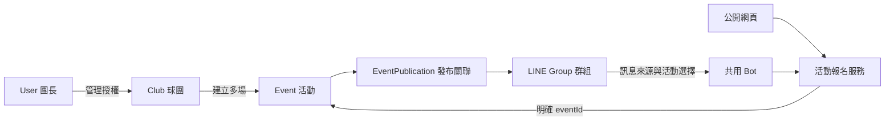

# 共用 LINE Bot：現況分析與漸進修改提案

日期：2026-10-03。狀態：已核定簡化方向、報名開關、姓名代操作與共用群加入審核；具體 schema／遷移仍為提案；本次僅更新分析文件，不修改程式、不遷移資料、不部署、不發 LINE 訊息。本文件以本機工作目錄為主；正式網站最後已記錄版本為 `5e1db53`，之後的團長後台、隔離及模組權限尚未發布。本次未讀取正式資料庫或 LINE Console。

## 已核定的調整（2026-10-03）

- 沿用現有 Firebase Realtime Database，不切換 Firestore。
- 不支援單獨 `+1`；球友沿用 `小明+1`、`小明+2` 等具名指令。
- 不新增 draft/open/closed/completed/cancelled 活動狀態設定。保留現有 registrationOpen「開放／暫停報名」按鈕。
- 固定成員按球團名單上的姓名辨識，不要求綁 LINE userId；群友可用姓名指令代操作請假／恢復；仍使用內部 memberId／registrationId 保護資料關聯，這些 ID 不需球友操作。
- 群內登錄指令改成「加入揪凱」。後台仍使用「新增 LINE 群組」等易懂名稱，不稱為綁定球團。
- 公告採「群內輸入發布指令，Bot 回覆公告」；不做網頁主動 push，不在回覆失敗時自動改成 push。
- 同群第二位核准團長輸入「加入揪凱」時，須經原登錄團長同意才取得群組使用權；不因此取得其他球團的私有資料權。
- 團長 LINE 帳號與 Google 帳號的安全對應仍保留在提案中，與「固定成員不綁 LINE」分開。

## 1. 現況與衝突

目前使用 Firebase **Realtime Database**，不是 Cloud Firestore。證據為 `_lib.js` 的 `admin.database()`、各 API 的 `db.ref(...).once/set/transaction`。登入沿用 Firebase Authentication 的 Google 登入，平台授權另存在 `accessV1/organizers/{Email雜湊}`；Admin 是平台權限管理角色，沒有跨球團私有資料權。

| 概念 | 本機現況 | 對新需求的影響 |
|---|---|---|
| User → Club | `ownTeam()` 由 UID 推導唯一 teamId；首位舊團長是 primary | 目前沒有 userClubs 清單，一人不能建立多團；需改成查球團會員關係，不能把 UID 當球團 ID |
| Club | 同一資料區的 `registration/team`；含長期設定及首場日期 | Club 已有原型，但不是獨立紀錄；沒有正式 manager membership |
| Event | `registration/current` 唯一目前活動；舊活動放 archives | 新建會歸檔上一場，不能同時多場接受報名；需獨立、不可變 eventId 與活動清單 |
| LINE Group | 環境變數 `LINE_GROUP_ID`，webhook 只接受這一群 | 尚無群組登錄、可使用群組權限或活動發布關聯 |
| LINE → Event | webhook 固定讀寫 `registrationV1/current` | 群組不能找到多場活動，也不能指向新團長球團 |
| Registration | 固定名單＋cancelledFixed，臨打 walkIns；name/source/time，網頁另含電話 | LINE 未存操作者 userId；報名沒有各自明確 eventId，靠包含它的 current 判斷；walkIns 重新編號，不能當穩定身分 |
| LINE 指令 | 支援小明+2、+2小明、參戰、取消及名單 | 單獨 `+1` 不符合 parser，依本次決策維持不支援；尚未處理 postback、accountLink、join/leave、webhook 去重 |
| 活動狀態 | registrationOpen 布林值 | 依本次決策不新增完整活動狀態；保留開放／暫停報名，第一版不另外新增日期截止規則 |
| 公開網頁 | 分享代碼 → 球團資料區 → current；本場連結校驗 activityId | 不能只憑 eventId 讀任意私有資料；多活動時固定連結需顯示活動列表 |
| 排點交接 | 確認包已含 teamId/eventId，保留人工調整與版本檢查 | 可沿用協定，但目前每人只有一份使用中的排點工作區；並行活動要有各自排點區或清楚切換 |
| 訊息產生 | buildRosterMessage 已動態讀名稱、時間、場地、費率及名單 | 可抽成純 renderer；缺場地數、用球、角色、補充文字，臨打目前從 1 重新編號且不列空位 |
| 活動預設 | Club 費率帶入 Event，但 create/edit 不支援單場費率覆寫 | 需要完整快照與單場覆寫，不能讓下週改設定連帶改到舊活動 |

既有資料路徑：舊團長 `/registrationV1/{team,current,archives}` 與 `/rankingV1`；其餘使用 `/teamsV1/{teamId}/{registration,ranking}`。分享索引為 teamSharesV1、公用代碼 publicTeamsV1；確認名單存 rosterHandoffs。上述本機 V1 不是正式環境已全面驗收的 schema。

## 2. 架構選項與建議

**已核定沿用 Realtime Database；建議保留 Google 登入、Vercel API、報名與排點兩套工具，新增 V2 領域資料與存取層，逐步切換。**

原提案的 Firestore 替代方案已不採用，不另做資料庫搬遷。RTDB 方案也不是永久零費用：多群組名單讀寫會增加流量，應避免全資料庫輪詢與根目錄交易。日常操作新增球團／活動選擇，舊團長先維持熟悉單團畫面。

群組可使用權與球團管理權分開；團長加入某群不會因此取得其他團長在該群發布活動的私有名單。平台 Admin 仍只能管理自己的球團。manager 清單為擴充能力，首版只開 owner；共同管理與轉移球團需另行核定，不能自行授權。

## 3. 建議 RTDB V2 schema

下面是資料樹節點，不是要開新的 Firestore collections。`clubId`、`eventId` 由伺服器產生，不能依名字、日期或 LINE groupId 推導。使用者輸入的 clubId/eventId 必須查伺服器授權。

| 新節點 | 主要欄位／用途 |
|---|---|
| usersV2/{uid} | 可選的使用者檔案、createdAt；Google 身分仍以 Firebase Auth 為準，模組權限仍沿用 accessV1 |
| clubsV2/{clubId} | ownerUid、managers/{uid}、name、defaults、recurrence、schemaVersion |
| recurrenceSeriesV2/{clubId}/{recurrenceId} | frequency、anchorDate、intervalWeeks、leadDays、generatedOccurrences；記錄每週系列及已生成場次，單次不建系列 |
| userClubsV2/{uid}/{clubId} | 管理球團索引；僅供查找，私有存取還要核對 clubs 的實際 membership |
| clubMembersV2/{clubId}/{memberId} | 穩定 memberId、name、roleLabel、固定身分；以姓名匹配固定名單，不保存或要求固定成員 LINE 綁定 |
| eventsV2/{clubId}/{eventId} | eventId、clubId、registrationOpen、date/time、地點、guestFee/fixedFee、courtCount/shuttlecock/capacity/message 的本場快照、固定成員快照、registrationState、publications、processedCommands、revision |
| eventsV2/.../registrationState/registrations/{registrationId} | eventId、clubId、participantType、displayName、source、status、memberId 可選、registeredBy（LINE 操作者來源紀錄，不作固定成員身分綁定）、proxyBatchId、guestIndex、createdAt；取消保留紀錄，不重新編號 ID |
| lineGroupsV2/{groupId} | webhook 的真實 groupId、groupName、botStatus、createdBy、createdAt；沒有唯一 clubId |
| userLineGroupsV2/{uid}/{groupId} | 這位團長是否可用此群發布；同一群可有多位團長各自的權限，取得方式見第 5 節 |
| eventsV2/.../publications/{publicationId} | EventPublication 正式紀錄；eventId、clubId、groupId、createdBy、createdAt、routeStatus、deliveryStatus、deliveredAt、renderedRevision 等 |
| lineGroupEventsV2/{groupId}/{eventId} | clubId、publicationId 的反查索引；收到群訊息只查此索引，並讀真實 Event/Publication 再確認 |
| eventLocationsV2/{eventId} | eventId → clubId 定位索引，不可作為授權憑證 |
| lineAccountLinksV2/{LINE userId} | providerId、firebaseUid、verifiedAt、status；公開 API 不得回傳 |
| accountLinkAttemptsV2/{nonceHash} | 有期限、一次性、綁定已登入 UID 的綁定請求，不紀錄完整秘密 |
| pendingLineChoicesV2/{opaqueToken} | groupId、LINE userId、action/count、候選 eventId、expiresAt、consumedAt；點選不能使用其他人的 token |
| eventSchedulesV2/{clubId}/{eventId} | 這一場的排點工作區；報名與排點名單保持獨立 |
| publicSharesV2/{opaqueCode} | 種類 club/event/schedule、clubId/eventId、可撤銷狀態；公開資料只用白名單回傳 |
| legacyMappingsV2/{legacyTeamId} | 舊路徑、新 clubId、遷移版本與啟用資料源；避免切換後雙方都能寫入 |

### Club defaults 與 Event 快照

Club defaults 放 defaultLocation、defaultGuestFee、defaultFixedFee、defaultCourtCount、defaultShuttlecock、defaultCapacity、defaultMessage、預設時間；固定成員用穩定 memberId。Event 建立時複製成當次設定並允許覆寫。修改 10/13 費用只改該 Event，不改 Club 預設、10/06 活動或已確認帳務。Club 名稱與固定成員顯示資訊也留本場快照，確保歷史能還原。

固定預繳與退款規則保持原樣，不把固定費率快照當成已收款。新增用球、場地數與補充文字屬新欄位；舊資料缺少時留空，不憑空填入。

### 為什麼 Publication 和 Registration 放在 Event 裡

它們仍是獨立領域概念，只是 RTDB 的實體存放位置採活動之下。可在一場活動的小範圍 transaction 內，同時檢查報名是否開放、發布資格、名額、重複報名及 webhook 去重，避免 LINE 與網頁搶最後名額時超收，也避免活動關閉／撤下與報名同時發生的競爭。排點、帳務、歷史全文不放進報名交易；反查索引只是查找提示，索引過期時必須 fail closed，而非接收猜測活動。[Firebase 交易說明](https://firebase.google.com/docs/database/admin/save-data)

固定成員預加入為 participantType=fixed 的報名列；請假改狀態，恢復再檢查容量、保留 memberId 與固定價格。穩定 registrationId 用於交接，仍保留姓名重複警告及小明1、小明2規則。

## 4. EventPublication 設計

同一 eventId＋groupId 原則上一個關聯，publicationId 可由這對 ID 的安全雜湊決定，避免雙擊產生重複發布。重新送出另記 attemptId、method、delivery結果，不建立另一份活動或名單。

- routeStatus：active/revoked，代表這個群是否能對此活動報名。
- deliveryStatus：awaitingCommand/sending/sent/failed，代表 LINE 公告實際送出狀態。
- publishedAt/deliveredAt 只在已確認送出後記錄；建立關聯但還沒送出不能顯示「已公告」。
- 不增加 Event status。活動是否接受報名與公告是否送出分開；registrationOpen 須為 true，且發布關聯有效才接受群組報名；不採最新建立的活動作為報名依據。
- 多群發布共用同一 Event／Registration transaction，不複製名單。
- Bot 離群時將 lineGroup botStatus 設不可用；其公告關聯失效但不刪活動與報名，公開網頁是否繼續由活動設定決定。
- 群組裡可看到已發布活動與原允許的公開名單，不公開電話、付款資訊、未發布活動或其他球團管理資料。

## 5. LINE 帳號與團長安全對應

Google Email 與 LINE 名稱不是同一身分；不可讓團長輸入 Email、LINE userId 或公開群組驗證碼就直接授權。

推薦 LINE Messaging API 的官方 account linking 流程：團長先加官方帳號為好友，在**一對一聊天**啟動帳號連結 → Bot 以當前 LINE userId 取得一次性 link token，使用當次 reply 回覆連結 → 在平台完成 Google 登入、確認本人帳號與團長權限 → 後端產生隨機單次 nonce，保存其 hash、UID 與期限 → LINE 回送簽章有效、result=ok 的 accountLink webhook → transaction 一次性消耗 nonce、確認沒被綁到另一帳號，建立 LINE userId ↔ Firebase UID。

帳號連結的一對一操作只對團長的初次設定需要；一般球友仍可在群組用姓名指令報名，不必每人 Google 登入。提供解除連結；撤銷團長權限時每次再查 accessV1，舊 LINE 對應不能繞過撤權。[LINE 官方帳號連結流程](https://developers.line.biz/en/docs/messaging-api/linking-accounts/)

### 新增 LINE 群組

1. 官方帳號加入群組；join 事件只能登記「Bot 已加入」，不能認定邀請者是團長。
2. 已完成帳號連結的團長在該群發「加入揪凱」。
3. 驗證簽章、source.type=group、真實 groupId 與 userId；無 userId 不授權。
4. 對應 Firebase UID，確認團長身分及報名管理權限，再確認是否符合群組使用授權規則。
5. 取得群組名稱（失敗可由團長設定顯示別名，不能代替 groupId），建 lineGroups 與該團長 userLineGroups。
6. 後台顯示「新增 LINE 群組」結果，不建立永久 Club 綁定。

重要邊界：在群內發訊息只證明該 LINE 帳號能在群內發言，不能證明是 LINE 群管理員。第一位已核准團長可登錄尚未有人登錄的群，後續其他團長加入須經原登錄團長同意；原登錄者並不是經 LINE 證明的群管理員。已核定須原登錄團長同意。建議操作流程改為：第二位團長在群內輸入「加入揪凱」→建立待核准請求→原登錄團長在後台看該群的申請與申請者 Email，明確同意→第二位團長取得該群使用權。沒有事先邀請也能提出申請；不得申請就直接通過，不主動 LINE 推播審核通知。兩人能發布自己的球團，不能看對方私有資料。LINE userId 也可能缺失，應提示使用網頁或完成必要授權，不按姓名猜本人。[LINE 使用者 ID 說明](https://developers.line.biz/en/docs/messaging-api/getting-user-ids/)

## 6. 具名報名與多場活動選擇

只接受已有姓名的指令，例如 `小明+1`、`小明+2`、`+1小明`；單獨 `+1` 不建立報名，也不使用 LINE 暱稱自動補姓名，可回覆「請輸入姓名，例如小明+1」。

簽章通過 → 以 webhookEventId 去重 → 取得 groupId 與操作者 userId（若有） → 查 lineGroupEvents → 驗證真實發布關聯與 Bot 群組可用性 → 篩選可報名活動。依 registrationOpen 篩選；不能取「最新一場」。

- 0 場：回覆此群目前無開放報名活動。
- 1 場：以指令裡的姓名與人數報該 eventId，不取 LINE 顯示名稱替代。
- 2 場以上：以 reply 回覆選場卡片，顯示日期、球團、時段、可用名額；活動多時分頁。使用者已放棄的是「無姓名 +1」，不是多場選擇。
- 選擇卡片帶隨機 opaqueToken，保存原姓名、action/count、來源群、操作者與期限。postback 時驗證來源群、原操作者、單次使用，再取得明確 eventId。其他人不能點卡片執行原操作者的指令；選場所需的 LINE userId 僅用於操作確認，並非固定成員綁定。
- 若沒有 userId，不能安全綁定卡片操作者；提示使用帶活動短碼的具名指令（格式為實作建議，待核定）或網頁，不猜姓名身分。
- 活動 transaction 再檢查報名開關、Publication、名額、姓名重複與命令去重。多群與網頁共用同一名單，同名不能重複佔位；不以 LINE userId 禁止同一人代不同姓名報名。
- `小明+2` 仍建立小明1、小明2，記 proxyBatchId、guestIndex；姓名碰撞提醒，不自動合併。
- 固定名單按輸入姓名匹配。已預加入時回覆已報名；請假後恢復仍檢查容量，成功仍保留固定價，不要求 LINE 帳號綁定。
- 不將姓名匹配說成已驗證本人：已核定群友可用姓名指令代操作固定成員請假／恢復；這是沿用群組接龍習慣，不宣稱已驗證本人或可防止他人冒名。不改成只讓團長操作。
- 取消、請假、恢復及查名單同樣需要多場選擇。匿名網頁維持既有姓名／手機檢查，不因這次提案強迫球友 Google 登入。若要改善臨打取消憑證，可另行提案，不混入本次已核定範圍。

[LINE webhook 重送說明](https://developers.line.biz/en/docs/messaging-api/receiving-messages/)

## 7. 報名開關與週期開團

不增加 draft/open/closed/completed/cancelled 狀態，不增加活動狀態選單。已核定沿用 registrationOpen 開放／暫停報名；公告關聯及送出結果是系統內部紀錄，不是活動狀態設定。

第一版沿用現有開關，不另新增自動截止規則。既有 assertOpen 只檢查開關，沒有活動結束時間檢查；活動時間經過但團長未暫停時，仍可能接受報名。歷史歸檔保持關閉；若日後要以日期自動截止，另行核定，不用這次放棄狀態選單的指示推導出新截止規則。

### 開團頻率（已核定）

建立活動時包含「開團頻率」，提供「固定每週／單次」，不只放在初次建立球團時。

- 單次：只建立本場，不自動往後開團。
- 固定每週：以第一場日期與時間為基準，自動往後建立每週活動；各場有自己的 eventId、報名與排點，不覆蓋前場紀錄。
- 自動生成場次沿用球團預設與固定成員名單。前場臨打、請假、人工排點、收款不帶入下一場，固定成員重新預設參加。單場費用覆寫不影響球團預設或後續場次。
- 自動開團沿用原本機制開放報名，不自動發 LINE 公告、確認名單、匯入排點或入帳。各群仍由團長輸入發布指令，Bot 才回覆公告。
- 每個週期系列使用 recurrenceId，以 recurrenceId＋occurrenceDate 識別唯一場次，排程重跑不重複建立。自動生成活動連到原系列，不建立另一個新系列；同系列同日期的手動建立也要檢查重複。

已核對原始機制：本機 cron-weekly.js 每日台灣時間 09:00 檢查；autoAdvance() 在上一場結束且到提前開放日期時生成下一場，跳過已過期場次。沿用這個節奏及提前天數，不一次無限生成未來活動；多活動架構改成保留獨立場次，不覆寫 current。原本還支援每 1–12 週，新表單以固定每週（間隔一週）／單次為主；舊資料若有其他間隔週數，遷移不可默默改值。上述是程式現況，不代表正式雲端排程已完成實測。

建議週期系列保存 anchorDate、intervalWeeks、leadDays 與已生成場次索引；活動保存 frequency、recurrenceId、occurrenceDate。單次不建立週期系列；某次選單次不應默默停止另一個既有系列。暫停單場報名與停止整個週期系列分開，停止系列的具體入口於實作階段提出，不刪已生成活動。

固定球團連結顯示可報名活動列表；單場連結只指該 eventId，不跳去新場。原固定網址可透過 legacy share mapping 繼續使用；排點 QR 明確指場次或顯示選場頁，不能默默換場。

## 8. 自動產生 LINE 訊息與費用衝突

已存在 buildRosterMessage，可拆出 `line-message-renderer.js` 純函式：讀本次 Event 快照與 registrationState，產生同一份後台預覽、公告文字與查名單回覆。增加場地數、用球、補充文字、角色；固定名單為當次實際參加者，請假另標示；臨打從有效固定人數之後連續編號，空位補到總額；剩餘由名額與有效報名算出。角色是顯示標籤，不代表平台權限。過長文字分段並符合 LINE message限制，不顯示電話／繳費。

「自動產生文字」可以沿用資料完成；「網頁按建立就 Bot 自動發去多群」必須主動 push，不能拿別群舊 replyToken 或任意 webhook 當免費跨群廣播。Push 按收件人數計數，共用官方帳號所有球團一起消耗額度，換成一個群發一次仍會用配額；reply不列入該配額。[LINE 計費說明](https://developers.line.biz/en/docs/messaging-api/pricing/)

### 已選定公告流程

1. 團長在後台建立活動、選擇可使用群組，系統依 Club／Event 自動產生公告預覽與活動短碼。
2. 每個目標群組中，由已授權團長輸入「發布 活動短碼」（確切指令字樣可在實作前調整）。
3. 後端驗證團長、球團與該群發布資格，再由 Bot 使用這一次群內指令的 replyToken 回覆公告。
4. 每個群組各自記錄送出結果；未送出顯示「等待群內發布」，失敗可重試，不冒稱成功。

不提供「網頁按一次就主動送到所有群」或任何 push 備援。每群需操作一次，但團長不用複製或重打完整公告。既有複製網頁報名連結功能保留；複製完整公告尚不是本次核定需求。不同群不能共用一次 replyToken。

## 9. 修改檔案與邊界

| 檔案／模組 | 擬調整 |
|---|---|
| lib/team-scope.js、manager-auth.js、access-service.js | Auth 只確認使用者與模組；club scope 按 membership 判定，public share 定位 Club/Event；Admin仍無跨團例外 |
| lib/registration.js、public-command.js | 保留／抽出容量、同名、固定請假恢復規則；活動快照、現有報名開關、穩定 registrationId 與 eventId |
| lib/line-command.js | 不加入純 +1；增加「加入揪凱」、發布短碼、具名指令的活動選擇，保留姓名代報；不得在parser猜球團 |
| api/webhook.js、api/_lib.js | 保留rawbody簽章；拆 accountLink/join/leave/message/postback handlers，移除固定唯一群與current路由；DB/LINE client與renderer分離 |
| api/registration-admin.js | 球團列表、活動列表、Event CRUD、群組選擇、發布預覽／結果，逐步擴現有API避免新增太多Vercel functions |
| api/status.js、signup.js、cancel.js | 公開 share＋明確 eventId，同場所有來源共用transaction，公共欄位白名單；固定成員請假／恢復沿用已核定姓名代操作規則 |
| api/cron-weekly.js | 按club recurrence建唯一場次，不覆寫current，不push、不匯入 |
| api/_handoff.js、roster-handoff.js | 按 club/event 交接，穩定ID與版本，V1/V2協定轉接 |
| api/_ranking.js、ranking-view.js | eventSchedules存取與公開QR白名單，保留獨立排點 |
| ranking/registration-panel.jsx | 球團切換、活動列表、defaults與本場欄位、群清單、訊息預覽與送出狀態 |
| ranking/main.js、handoff-panel.jsx、handoff.js | 帶明確club/event scope；逐活動排點，保留人工調整與歸檔；不全面改排點演算法 |
| ranking/permissions-panel.jsx | 保留Admin名單與模組開關；群組使用權不與模組權限混為一談 |
| 報名機器人/index.html | 固定入口改活動選擇、本場網址維持明確eventId；匿名入口不被強迫Google登入 |
| 擬新增lib | club-repository、event-repository、line-account-link、line-group-service、event-publication、line-message-renderer、line-event-router，按階段新增必要項目 |
| docs與tests | schema、遷移映射／預演工具、權限與LINE流程測試、PRODUCT_SPEC核定後同步 |

## 10. 分階段與 migration

1. **先做多 Club／多 Event 與共用活動報名服務**：加V2 paths和repository adapter、球團與活動切換、既有報名開關、defaults快照與renderer預覽；不接真LINE、不送公告。保存V1 API讀取相容方式，先用虛構資料跑並行兩團兩場。
2. **安全身分＋新增 LINE 群組＋Publication**：團長account linking、群組登錄／原登錄團長審核、群使用清單、活動發布關聯、群內公告指令。先測fakewebhook，再經授權小群實測。
3. **具名指令多場選擇與跨入口一致性**：postback selection、穩定報名ID、去重、同名與代報、姓名匹配固定成員、固定成員請假／恢復的姓名代操作、共同容量transaction。
4. **排點逐活動與週期活動整合**：手動確認＋差異匯入、不覆寫人工排點；QR場次路由、排程唯一occurrence。真正跨模組串接仍維持團長主動操作。
5. **最後才核准遷移／正式發布**：在正式資料授權後備份與dry-run、列差異、不覆寫；校驗原人數、請假、費率、ID、share與排點；一次一團切activeStore。不能V1/V2同時接受寫入，不做脆弱長期雙寫。遇切換後已有V2新報名，回復前先暫停寫入並回存增量，不能直接丟回V1損失資料。

具體映射：每個舊teamId映一clubId；team長期設定拆club defaults；current與archives各映Event並保留既有activityId，舊資料缺ID者生成且保存穩定對照。歷史歸檔保留，不新增 completed/cancelled 狀態；歷史活動沿用歸檔時的 registrationOpen=false，缺少開關的舊紀錄須預演列出，不能默默開放；固定請假、人工名單、已確認交接與排點paid等私有欄位原樣保存。舊LINE群需原團長完成驗證再列可用清單，不因環境變數存在就授權新團長。

報名ID需保存舊名單交接ID→新registrationId映射，不能全換ID造成再次匯入全部視為新人。舊分享碼保留映射到新Club/Event/排點；只使用排點的帳號也保留獨立工作區，不強迫先建報名活動。舊/session、/badminton、來源提供者資料與唯讀sources不遷移或刪除。正式Firebase規則需配合新版私有API封住舊直讀通道，不能只部署UI就宣稱權限隔離完成。

### 最小驗收

純 +1 不報名；小明+1／小明+2維持支援；一人兩團；不同人共用群但不能互讀私有資料；一群兩場開放報名＋一場暫停報名不誤路由；同場多群＋網頁搶最後位不超收；卡片別人點擊／過期／選擇後暫停報名則拒絕；webhook重送不多報；同名與代報編號不退化；具名指令可匹配未綁 LINE 的固定成員、恢復仍用固定價；單場覆寫不改預設與歷史；Bot離群/撤權/解除綁定正確；Publication送出失敗不誤報成功；QR不洩露電話與付款；再次匯入保留人工排點；遷移重跑不重複、不變原IDs；舊連結與單獨排點仍可用。

## 11. 確認結果與實作邊界

已確認：沿用 RTDB、不支援純 +1、不新增活動狀態選單、保留開放／暫停報名、固定成員姓名辨識且可群友代請假／恢復、「加入揪凱」登錄、其他團長須原登錄團長同意、公告採各群輸入發布指令後 reply。

本次沒有需要阻止文件調整的未決問題。汝婷已要求加入開團頻率並準備執行；本次完成文件更新與第一階段範圍整理。具體 V2 schema、遷移與正式發布仍屬提案，不代表正式資料操作已獲授權。團長 Google／LINE 安全連結維持前提，與固定成員不綁 LINE 分開。活動短碼指令格式、無 LINE userId 的選場備援、審核頁操作可於相應階段提出小範圍預覽；不先大規模 refactor。

開放／暫停目前由團長管理；此次不擅自增加活動結束時間自動截止。固定成員姓名代操作是已核定群組行為，不宣稱為本人驗證。共用群加入審核只授予該群的發布使用權，不擴大其他球團的資料權限。

## 12. 第一階段執行準備

已核對現有表單、排程與資料路徑。第一階段交付本機虛構資料預覽，不發布、不改正式 Firebase、不送真實 LINE 訊息。

1. 新增 Club／Event 存取層與球團、活動選擇，沿用 Google 登入、模組權限及球團隔離。
2. 活動建立加入固定每週／單次、週期系列、獨立場次與設定快照；週期功能列入第一階段，不延後才補。
3. 保留姓名重複、容量、固定成員姓名請假／恢復、穩定報名 ID，完成自動產生公告文字預覽。
4. 使用虛構資料驗證每週生成、單次不續開、重跑不重複、兩場並行、單場改價不改其他場，以及前場人工排點保留。
5. 新版預覽另開隔離環境，保留原 8767／8768 的測試資料；完成後交付畫面與驗證結果。

正式遷移先做預演、列差異，再依授權執行；保留兩套工具，不全面重寫排點演算法。

## 本機實作進度（2026-10-03）

已加入可選啟用的多球團／多活动模型、單次與每週續開、活動名單管理、公告預覽與逐場排點交接。過渡實作將 events、series 存於 `clubsV2/{clubId}`，以球團交易保護版本；排點獨立存於 `eventSchedulesV2/{clubId}/{eventId}`。目前僅球團 owner 可管理，平台 Admin 不可越權查看。尚未執行資料遷移、正式資料庫規則變更或部署。群組登錄、團長 LINE 綁定、群組共享核准、群內公告與多活動 LINE 指令仍待後續實作。

## 第二階段本機實作（2026-10-04）

已新增團長官方 accountLink 流程、群組登錄／共用申請審核、逐活動多群 Publication 與「發布揪凱＋指令碼」reply 公告。過渡資料集中於私有 `lineIntegrationV2`，群組／帳號／關聯用交易維持一致；目前事件仍沿用 `clubsV2`，不複製名單。原設計表中的分開路徑是目標模型，本次沒有一次搬動全部路徑。只啟用本機旗標與虛構模擬器；正式規則、資料與部署均未變更。第三階段群內姓名報名仍待實作。詳細設定、驗證與限制見 [測試說明](line-phase2-testing.md)。

## 第三階段本機實作（2026-10-04）

已接上群內具名報名／取消／固定請假恢復／查名單及多場 postback 選擇。沿用原 LINE command 純函式與活動名單，新增活動內 linePublications 授權關聯及 lineCommands 去重；短效選場存在私有 lineIntegrationV2。到活動結束時間立即拒絕球友報名，同系列只允許前場結束且到開放日後輪到下一週，保留歷史。詳見 [測試说明](line-phase3-testing.md)。本機模式已驗證；真實 LINE、正式 Firebase、遷移與部署仍未進行。
